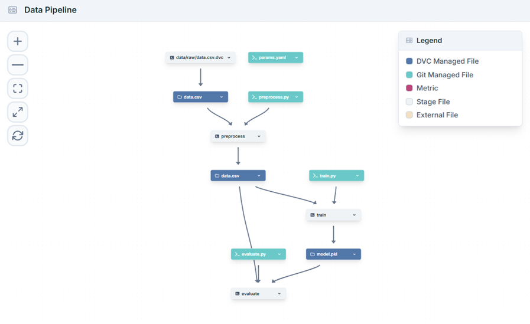

# Data Pipeline with DVC and MLflow for Machine Learning

This repository demonstrates a reproducible, end-to-end machine learning
pipeline using DVC (Data Version Control) for data and model versioning and
MLflow for experiment tracking. The example trains a Random Forest Classifier
on the Pima Indians Diabetes dataset and provides clear stages for data
preprocessing, training, and evaluation.

**Contents**
- **Overview**: What this project does and why.
- **Key features**: DVC + MLflow integration and reproducible stages.
- **Quickstart**: Install, configure, and run the pipeline locally.
- **Usage**: How to run experiments and inspect results.

## Overview

This pipeline is split into explicit stages (preprocessing, training,
evaluation) managed by DVC. Each stage captures inputs, outputs, and
parameters so you can reproduce any experiment by re-running the pipeline.

MLflow is used to log metrics, parameters, and model artifacts for easy
comparison of runs and model promotion.

## Pipeline Overview

The end-to-end DVC pipeline (`preprocess → train → evaluate`), as visualized
in DagsHub:

<p align="center">
  
</p>

Each node is either a **stage** (`preprocess`, `train`, `evaluate`) or a file
it depends on / produces — DVC-managed files (data, model) in blue and
Git-managed files (scripts, params) in teal.

## Key Features

- Reproducible pipeline stages with `dvc repro`.
- Data and model versioning via DVC (supports remote storage like S3/DagsHub).
- Experiment tracking and model logging with MLflow UI.
- Example model: Random Forest classifier on the Pima Indians Diabetes dataset.

## Repository Structure

- `mlpipeline/` — pipeline scripts and DVC stage definitions.
- `data/` — raw and processed datasets (tracked by DVC).
- `models/` — trained model artifacts (tracked by DVC/MLflow).
- `README.md` — this file.

Adjust paths above if you organized files differently in your workspace.

## Requirements

- Python 3.8+
- pip
- DVC (installed globally or in the virtualenv)
- MLflow

Install Python dependencies (example):

```bash
python -m venv .venv
source .venv/bin/activate  # On Windows use: .venv\Scripts\activate
pip install -r requirements.txt
pip install dvc mlflow
```

## Quickstart — initialize and run

1. Initialize DVC (if not already initialized in the repo):

```bash
cd mlpipeline
dvc init
```

2. (Optional) Configure DVC remote storage for large datasets and models:

```bash
dvc remote add -d myremote s3://my-bucket/path   # or use DagsHub, etc.
dvc push
```

3. Run the full pipeline (reproduces all stages):

```bash
cd mlpipeline
dvc repro
```

4. View MLflow UI to compare runs:

```bash
mlflow ui --host 0.0.0.0 --port 5000
# then open http://localhost:5000 in your browser
```

## Typical workflow

- Make a change to a preprocessing, training script, or parameters.
- Run `dvc repro` to re-run affected stages.
- Use `dvc metrics show` or MLflow UI to inspect metrics.
- Commit parameter and pipeline changes to Git; use `dvc push` to upload
  large data/model artifacts to the DVC remote.

## DVC notes

- Each DVC stage should be declared in `dvc.yaml` under `mlpipeline/`.
- Use `dvc add` to track large files/directories (datasets, model artifacts).
- Use `dvc checkout` to restore data for a given Git commit.

## MLflow notes

- MLflow runs are logged by the training stage; models and metrics are
  recorded for comparison and deployment.
- You can change the MLflow tracking URI via environment variable
  `MLFLOW_TRACKING_URI` to point to a remote server if needed.

## Data source

The example uses the Pima Indians Diabetes dataset (public). Ensure any
datasets used comply with their licenses and privacy requirements.

## Reproducibility and CI

- Pin package versions in `requirements.txt` for reproducible
  environments.
- In CI, use `dvc pull` to fetch datasets before running `dvc repro`.

## License

This project is provided as an example. Add an appropriate LICENSE file
if you intend to publish or distribute the code.

## Pipeline Stages

The pipeline is defined in `dvc.yaml` and runs in the order
`preprocess → train → evaluate`. The stages were created with the following
`dvc stage add` commands (run from the `mlpipeline/` folder):

### 1. Preprocess

Reads the raw dataset and writes the processed dataset.

```bash
dvc stage add -n preprocess \
    -p preprocess.input,preprocess.output \
    -d src/preprocess.py -d data/raw/data.csv \
    -o data/processed/data.csv \
    python src/preprocess.py
```

### 2. Train

Trains a Random Forest classifier (with hyperparameter tuning), logs to
MLflow, and saves the model.

```bash
dvc stage add -n train \
    -p train.data,train.model,train.random_state,train.n_estimators,train.max_depth \
    -d src/train.py -d data/processed/data.csv \
    -o models/model.pkl \
    python src/train.py
```

### 3. Evaluate

Loads the trained model, evaluates it, and logs the test accuracy to MLflow.

```bash
dvc stage add -n evaluate \
    -d src/evaluate.py -d models/model.pkl -d data/processed/data.csv \
    python src/evaluate.py
```

Once the stages are defined, run the entire pipeline with:

```bash
dvc repro
```
